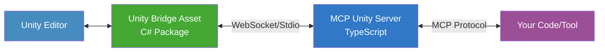



**Control Unity Editor like a boss with MCP.**

## What is this?

The MCP Unity Manager Server is a TypeScript powerhouse that lets you control Unity Editor programmatically through the Model Context Protocol (MCP). Built to work seamlessly with the [Unity Bridge Asset](https://github.com/modelcontext/mcp-unity-bridge-asset), it's your gateway to automating Unity tasks like a pro.

## Key Features

- 🎮 **Full Unity Control**: Create, modify, and delete assets, GameObjects, and scenes
- 🔌 **Flexible Connection**: WebSocket or Stdio - you choose how to connect
- 🧵 **Thread Safe**: We handle all the threading bullshit so you don't have to
- 🚀 **Simple API**: Clean, intuitive interface for Unity automation
- ⚡ **Fast & Reliable**: Built for performance and stability

## Quick Setup

1. **Install the Unity Bridge**

   ```bash
   # In Unity: Window -> Package Manager -> + -> Add package from git URL
   https://github.com/modelcontext/mcp-unity-bridge-asset.git
   ```

2. **Configure the Bridge**
   - Unity Editor -> Edit -> Project Settings -> MCP Bridge
   - Set WebSocket port (default: 8765)

3. **Run this Server**

   ```bash
   npm install
   npm run build
   npm start
   ```

## Basic Usage

```typescript
// Create a new material
await mcpClient.execute('manage_asset', {
    operation: 'create',
    assetPath: 'Assets/Materials/NewMaterial.mat',
    assetType: 'Material'
});

// Create and position a cube
await mcpClient.execute('manage_gameobject', {
    operation: 'create',
    objectName: 'MyCube',
    properties: {
        position: { x: 0, y: 1, z: 0 }
    }
});

// Save the current scene
await mcpClient.execute('manage_scene', {
    operation: 'save',
    scenePath: 'Assets/Scenes/MyScene.unity'
});
```

## How It Works



## Configuration

```typescript
// Server config (environment variables or config file)
export MCP_TRANSPORT_TYPE=websocket  # or stdio
export MCP_WEBSOCKET_PORT=8765      # must match Unity Bridge setting
```

## Unity Bridge Configuration

Tools > MCP Bridge > MCP Bridge Settings


## Available Tools

| Tool | Description | Status |
|------|-------------|---------|
| 🎨 **manage_asset** | Create, modify, delete Unity assets | **Stable** |
| 🎲 **manage_gameobject** | Control GameObjects and components | **Stable** |
| 📦 **manage_scene** | Handle scene operations | **Beta** |
| 🔄 **ping_unity_bridge** | Test connection to Unity | **Stable** |

## Requirements

- Unity 2022.3.0f1 or later
- Node.js 18+
- TypeScript 4.9+

## Need Help?

- Check the [Unity Bridge docs](https://docs.modelcontextprotocol.io/unity-bridge)
- Open an issue with:
  - What you tried
  - What screwed up
  - Error messages
  - Relevant code

## Contributing

1. Fork this
2. Create your feature branch
3. Make your changes
4. Test your stuff
5. Submit a pull request

## License

MIT - Do whatever the f you want

---
Made with 🖕 using [Model Context Protocol](https://modelcontextprotocol.io)
